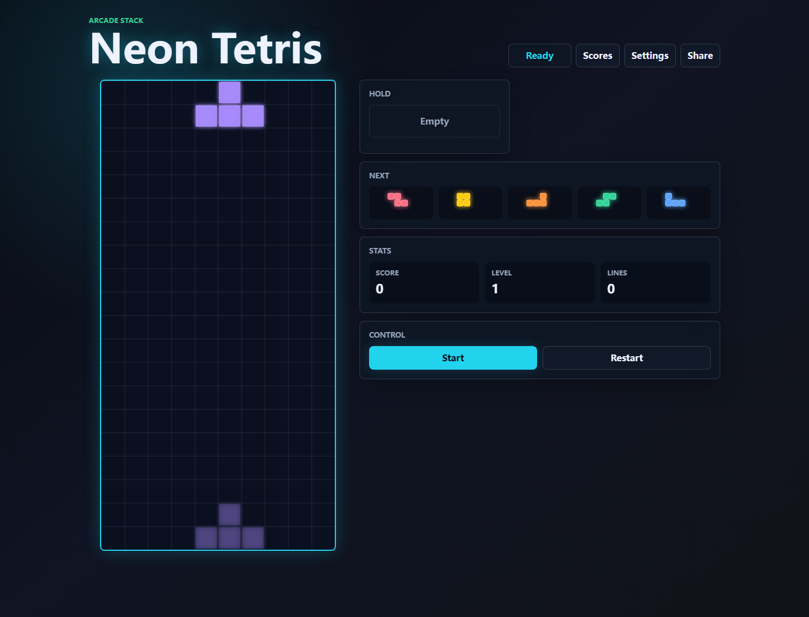
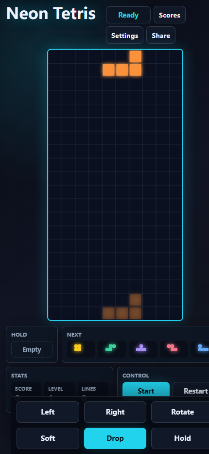

# Neon Tetris

Neon Tetris 是一个面向桌面端和 H5/移动端的单人俄罗斯方块网页游戏。项目使用 React + TypeScript + Canvas 实现游戏界面，核心规则保持为纯 TypeScript 模块，便于测试和后续扩展。

## 截图

### 桌面端



### 移动端



## 功能特性

- 标准 10 x 20 俄罗斯方块棋盘。
- 7-bag 随机出块，降低连续重复带来的极端随机性。
- 支持移动、旋转、软降、硬降、Hold、Next 队列和 Ghost Piece。
- 内置计分、等级、消行统计和随等级提升的重力速度。
- 桌面键盘控制和移动端触控按钮。
- 本地排行榜，使用 `localStorage` 持久化，存储不可用时回退到内存。
- 设置弹窗，当前包含 Neon Dark 主题和声音开关结构。
- 分享分数，优先使用 Web Share API，失败时回退到剪贴板。
- PWA 配置，支持 manifest、自动更新 service worker 和离线资源预缓存。

## 技术栈

- Vite 7
- React 19
- TypeScript 5
- Canvas 2D API
- Vitest
- Testing Library
- vite-plugin-pwa
- pnpm

## 运行方式

安装依赖：

```powershell
pnpm.cmd install
```

启动开发服务：

```powershell
pnpm.cmd dev
```

生产构建：

```powershell
pnpm.cmd build
```

本地预览生产包：

```powershell
pnpm.cmd preview
```

运行测试：

```powershell
pnpm.cmd test
```

## 操作方式

### 键盘

| 按键 | 行为 |
| --- | --- |
| Left / Right | 左右移动 |
| Down | 软降 |
| Space | 硬降 |
| Up / X | 顺时针旋转 |
| Z | 逆时针旋转 |
| C | Hold |
| P | 暂停 / 继续 |
| R | 重新开始 |

### 触控

移动端底部提供 `Left`、`Right`、`Rotate`、`Soft`、`Drop` 和 `Hold` 按钮。

## 项目结构

```text
src/
  components/      React UI、Canvas 渲染、弹窗和移动端控制
  game/            纯 TypeScript 游戏核心、棋盘规则、随机器和选择器
  hooks/           游戏循环、键盘控制和持久化状态 Hook
  share/           分数分享逻辑
  storage/         本地排行榜和设置存储
public/
  icons/           PWA 图标
docs/
  screenshots/     README 截图
  superpowers/     设计与实现计划文档
```

## 架构说明

游戏规则位于 `src/game`，不依赖 React、DOM、Canvas 或浏览器存储。React 负责组合页面状态和交互，`GameCanvas` 只从当前游戏状态绘制棋盘、活动块、锁定块和 Ghost Piece。这样的分层让核心规则可以通过 Vitest 单独验证，也便于未来增加更多主题、音效或在线排行榜。

## 验证

当前自动化覆盖包含：

- 7-bag 随机器和核心常量。
- 棋盘碰撞、合并、消行和 Ghost Piece。
- 移动、旋转、软降、硬降、Hold、计分、升级和 Game Over。
- 本地存储读写和异常回退。
- 排行榜、设置、分享、PWA 按钮和弹窗交互回归。

常用验收命令：

```powershell
pnpm.cmd test
pnpm.cmd build
```

## 后续扩展方向

- 增加音效和可调节音量。
- 增加更多主题皮肤。
- 增加 SRS 更完整的旋转踢墙规则。
- 增加在线排行榜或账号体系。
- 增加移动端横屏布局专项优化。
